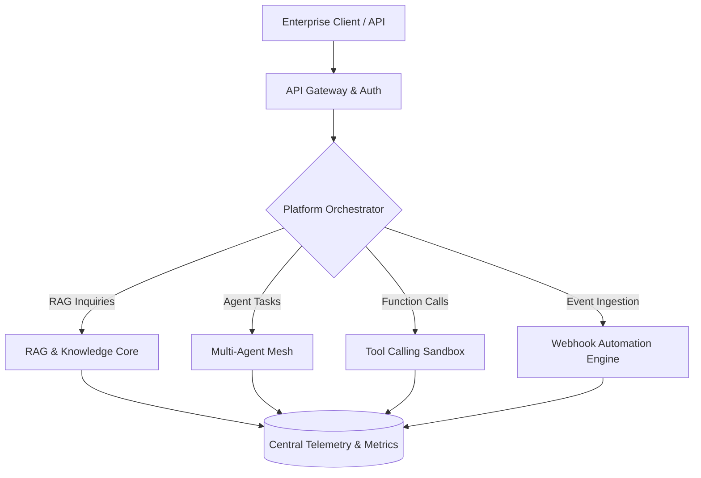

# AI Automation Platform (Flagship)

The flagship SaaS platform synthesizing all core architectures of the **50 AI Automation Projects Portfolio**:
- **Multi-Tenant Architecture**: Isolated environments with API-key RBAC authentication.
- **RAG Knowledge Hub**: Heterogeneous multi-format document indexing with page-level citations.
- **Autonomous Agent Meshes**: Hierarchical and peer-to-peer agent choreography.
- **Dynamic Tool Dispatcher**: Sandboxed function calling with safety AST guardrails.
- **Central Telemetry & Observability**: Real-time latency tracking, execution logs, and audit trails.

Part of the **50 AI Automation Projects Portfolio** by [ERHA TECHNOLOGIES](https://github.com/erhatechnologiesai).

---

## Architecture


## Testing
```bash
python -m unittest tests/test_platform.py
```

## License
MIT License. Developed by ERHA TECHNOLOGIES.
